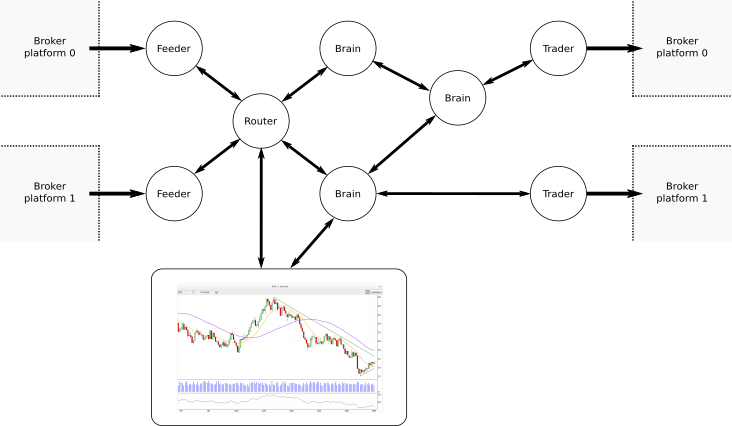

% DEVELOPING A REAL-TIME AUTOMATED TRADING PLATFORM WITH PYTHON
% Miguel Sánchez de León Peque
% 2016-07-18

# About

## Us

- [OpenSistemas](http://www.opensistemas.com)
- [www.opensistemas.com](http://www.opensistemas.com)
- R&D division
- [Fernando Monera Daroqui](https://www.linkedin.com/in/monera)
  fmonera@opensistemas.com

## Me

- [Miguel Sánchez de León Peque](https://www.linkedin.com/in/peque)
  msdeleon@opensistemas.com
- **Industrial engineer**
- Passion for **programming, data and ML**
- Met **Python** about 2 years ago

# Motivation

## Search engine results

- TradeStation
- Metatrader
- NinjaTrader
- Many others...

## Cons

- Proprietary
- Heavily desktop oriented
- Linux support?
- Can I use Python to create my strategies?

## What we wanted

- Control
- Optional GUI
- Multiplatform
- Python

----

> Is this possible?

# osMarkets

## Basics

- **Broker-independent** platform
- Implemented **over osBrain**
- Designed for **real-time automated trading**

## Overview


## Feeder

- Get market data
- Multithread

## Overview


## Router

- Broker independent provider
- Stores/distributes
- Update/resample

## Market data

- Tick
- Bar
- Bar Series

## Bar series


## Overview


## Brain

- Subscriptions
- Run algorithms
- Send orders
- Great ecosystem
- Can do anything

## Abstraction


## Overview


## Trader

- Handle orders
- Multithread

## Example


## Other agents

- Logger
- Informer
- Overmind

# GUI

## Features

- Real-time **market data visualization**
- Real-time **indicators visualization**
- **Integration** with osMarkets

## Qt

- Great **portability**
- Probably the **most widely used**
- LGPL

## PyQtGraph

- **Pure Python** graphics library
- **Fast** real-time display
- User **interaction**
- MIT

## Overview

- [Main Window](./video/gui_main_window.webm)
- [Chart](./video/gui_chart.webm)
- [Indicators](./video/gui_indicators.webm)

## Note



# osBrain

## Basics

> A **general purpose** multi-agent system

- Independent agents
- Message passing
- Easy configuration and deployment

## Other use cases


## Processes vs. threads

Have you met GIL?

## ØMQ

> ØMQ is very cool -
> If you don't have a project that needs it... ¡create one!

## Why?

- Higher level than raw sockets
- Asynchronous communication
- Multiconnetion (not necessarily one-to-one).
- Multipattern (REQ-REP, PUB-SUB...).
- Multitransport (inproc, ipc, tcp, pgm, epgm).
- Multilanguage (C, C++, Python, Scala, Haskell, Go...).
- Multiplatform.
- Scalable (threads, processes, machines)
- LGPL.

----

{width=15cm}

## A basic agent

- Is a system **process**
- Implements methods for easy **binding** and **connecting** with different
  **patterns**
- Activates on **incoming message**
- Mulithreading may be used (*inproc* socket)

## Configuration

> Agents are independent, but they must know the addresses of other agents


- There may be **many sockets**!
- For most agents, assigning a **random address** is simpler

## If only we could...

- Have a **name server**
- Have an **Overmind**...

## Pyro4

- **PY**thon **R**emote **O**bjects
- Treat remote objects as local
- Already has a name server implementation

## A real agent

- Is a system **process**
- This process runs a **Pyro multiplexed server**
- The server serves an actual **Agent object**
- Main thread runs the **main loop** (one-way)
<!--
- Other threads allow for **concurrent access for configuration** (*c = 2*)

## Safe calls

```python
def example(self, x):
    self.x = x

def example_safe(self, x):
    self.call_safe('example', x)
```
-->

## Conclusion

- General-purpose multi-agent system with Python
- Independent agents (processes)
- Message passing using ØMQ
- Easy deployment and remote configuration using Pyro4

# Code examples

## An example (I)

```python
from osbrain import random_nameserver
from osbrain import run_agent


def hello_world(agent):
    agent.log_info('Hello world!')


if __name__ == '__main__':

    # System deployment
    ns = random_nameserver()
    agent = run_agent('Agent0', nsaddr=ns)

    # System configuration
    agent.set_method(iddle=hello_world)
```

## An example (II)

```python
from osbrain import random_nameserver
from osbrain import run_agent


def log_message(agent, message):
    agent.log_info('received: %s' % message)


def hello_world(agent):
    agent.log_info('Sending message...')
    agent.send('push', 'Hello, world!')


if __name__ == '__main__':

    # System deployment
    ns = random_nameserver()
    pusher = run_agent('Pusher', nsaddr=ns)
    puller = run_agent('Puller', nsaddr=ns)

    # System configuration
    addr = pusher.bind('PUSH', alias='push')
    pusher.set_method(iddle=hello_world)
    puller.connect(addr, handler=log_message)
```

## An example (III)

```python
from osbrain import random_nameserver
from osbrain import run_agent
from osbrain import BaseAgent


class Push(BaseAgent):
    def on_init(self):
        self.bind('PUSH', alias='push')

    def iddle(self):
        self.log_info('Sending message...')
        self.send('push', 'Hello, world!')

def log_message(agent, message):
    agent.log_info('received: %s' % message)


if __name__ == '__main__':

    # System deployment
    ns = random_nameserver()
    pusher = run_agent('Pusher', nsaddr=ns, base=Push)
    puller = run_agent('Puller', nsaddr=ns)

    # System configuration
    puller.connect(pusher.addr('push'), handler=log_message)
```

## An example (IV)

```python
from osmarkets.brain import Brain
from osmarkets.architecture import OandaArchitecture


class Example(Brain):
    def on_new_bar(self, series):
        # Algorithm
        if series[0].close > series[1].close:
            side = 'buy'
        else:
            side = 'sell'
        # Order
        self.send_order(side=side,
                        size=100,
                        symbol=series.bsid.symbol)


if __name__ == '__main__':

    system = OandaArchitecture(logging=True,
                               account_id=123456,
                               access_token='123abc-345def',
                               environment='live')
    system.stream(['EUR_USD'])

    system.add_brain('example', base=Example)
    system['example'].set_attr(DEBUG=True)
    system['example'].subscribe(('EUR_USD', 1, 'Minutes'), 100)
```

# Final conclusion

----

> ♥ Python ♥

# One last thing...

----

{width=15cm}

- [https://pypi.python.org/pypi/osbrain](https://pypi.python.org/pypi/osbrain)
- [https://github.com/opensistemas-hub/osbrain](https://github.com/opensistemas-hub/osbrain)
- [https://pythonhosted.org/osbrain/index.html](http://pythonhosted.org/osbrain/index.html)

# The end

## References

- [osBrain](https://github.com/opensistemas-hub/osbrain)
- [ØMQ](http://zguide.zeromq.org/)
- [Pyro4](https://pythonhosted.org/Pyro4/)
- [PyQtGraph](http://www.pyqtgraph.org/)
- [Numpy](http://www.numpy.org/)

## Contact

- [Miguel Sánchez de León Peque](https://www.linkedin.com/in/peque)
  *msdeleon@opensistemas.com*
- [Fernando Monera Daroqui](https://www.linkedin.com/in/monera)
*fmonera@opensistemas.com*
- [www.opensistemas.com](www.opensistemas.com)
- [robintradinghub.com](http://robintradinghub.com/)
- [blog.opensistemas.com](http://blog.opensistemas.com/)
- [twitter.com/opensistemas](https://twitter.com/opensistemas)

## Thank you!

- Questions?
- Comments?
- Suggestions?
